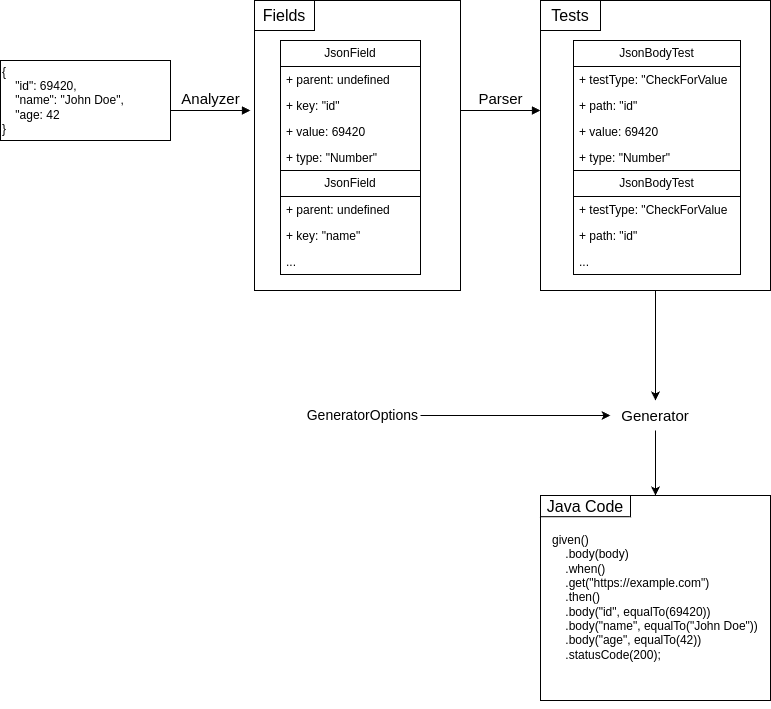

# RestAssured Test Generator

A transpiler to convert JSON response body to Java RestAssured assertions.

This project contains both a CLI and a library that can be used to generate RestAssured assertions from JSON responses. 

> 🚧 Warning: This is a work in progress and breaking changes shall be expected, specially with the CLI.


# 1. Installation

This is a Node.js project. To use the command line, you can use it without installation through npx (recommended):

```sh
npx restassured-test-generator [your-cli-options]
```
Alternatively, you can install it globally:

```sh
npm i -g restassured-test-generator
restassured-test-generator [your-cli-options]
```

If you want to use it as a library, you can install it locally on your project:
```sh
npm install restassured-test-generator
```

# 2. Usage

The project contains a JSON to RestAssured transpiler that will convert a given JSON corresponding to a REST API response to a Java RestAssured assertion. The compiler also accepts a number of options that can be used to customize the generated code. These options include information about status code, headers, cookies, etc. That will be included on the generated assertion.

Currently, however, not all the options are available through the CLI, which is a work in progress and will be updated soon.

## 2.1. CLI

As of the current version, the following options are available via the CLI.

<table>
<thead>
    <tr>
        <th> Option </th>
        <th> Description </th>
    </tr>
</thead>
<tbody>
    <tr>
        <td> -s, --string &lt;json&gt;</td>
        <td> Pass the contents of the JSON response as a string.</td>
    </tr>
    <tr>
        <td> -f, --file &lt;file&gt;</td>
        <td> Read the contents of the JSON response from a file.</td>
    </tr>
    <tr>
        <td> -sc, --status-code &lt;code&gt; </td>
        <td> Include information about the status code on the generated test.</td>
    </tr>
    <tr>
        <td> 
            --delete &lt;url&gt; <br> 
            --get &lt;url&gt; <br/> 
            --head &lt;url&gt; <br/> 
            --options &lt;url&gt; <br/>
            --patch &lt;url&gt; <br/>
            --post &lt;url&gt; <br/>
            --put &lt;url&gt; <br/> 
        </td>
        <td>Include information about the request url and HTTP method (only one is allowed per test) on the generated test.</td>
    </tr>
</tbody>
</table>

Example usage:

```sh
$ restassured-test-generator -s '{"id": 69420, "name": "John Doe", "age": 42}' -sc 200 --post https://example.com

given()
    .when()
    .post("https://example.com")
    .then()
    .body("id", equalTo(69420))
    .body("name", equalTo("John Doe"))
    .body("age", equalTo(42))
    .statusCode(200);
```

## 2.2 Library

The transpiler can be imported as a standalone library and used in a JavaScript project. The library exports a Compiler object containing a compile function that accepts a JSON string, and can also take additional options for the test generation, and returns a Java RestAssured assertion string.

Example usage:
```js
import { Compiler, VarOrValue } from 'restassured-test-generator';

const jsonString = `{"id": 69420, "name": "John", "age": 42}`;

const compilerOptions = {
    simplify: true,
    generatorOptions: {
        format: true,
        request: {
            method: 'POST',
            url: new VarOrValue('https://example.com').asValue(),
            statusCode: 200
        }
    }
};

const output = Compiler.compile(jsonString, compilerOptions);

console.log(output);
// given()
//    .when()
//    .post("https://example.com")
//    .then()
//    .body("id", equalTo(69420))
//    .body("name", equalTo("John Doe"))
//    .body("age", equalTo(42))
//    .statusCode(200);
```

The VarOrValue class is a wrapper around a string that can be either a variable or a value. This is useful when the test body compares against a variable created previously on the Java code, so that the output is not surrounded by quotation marks:

```js
import { Compiler, VarOrValue } from 'restassured-test-generator';

const jsonString = `{"id": 69420, "name": "John", "age": 42}`;

const compilerOptions = {
    simplify: true,
    generatorOptions: {
        format: true,
        request: {
            method: 'POST',
            url: new VarOrValue('https://example.com').asVar(),
            statusCode: 200
        }
    }
};

const output = Compiler.compile(jsonString, compilerOptions);

console.log(output);
// given()
//    .when()
//    .post(url)
//    .then()
//    .body("id", equalTo(69420))
//    .body("name", equalTo("John Doe"))
//    .body("age", equalTo(42))
//    .statusCode(200);

```

The Compiler object also exposes functions that allow access to the different steps of the transpiler:

```js
import { Compiler } from 'restassured-test-generator';

const jsonString = `{"id": 69420, "name": "John", "age": 30}`;

const fields = Compiler.analyze(jsonString);
const tests = Compiler.parse(fields);
const output = Compiler.generateTests(tests);
```
# 3. Architecture

<!-- TODO: Update documentation -->
The transpiler architecture follows somewhat closely the traditional compiler design pattern, each step being its own module.



Since parsing JSON is trivial when using the JS standard library, the tokenizer in a traditional compiler is replaced by an analyzer. The analyzer is responsible for extracting information from JSON and building a list of nodes that represent the JSON fields.

The parser takes the list of JSON fields and converts it to a list of assertion tests for the JSON body. It can generate an individual test for each field, and optionally, simplify some tests by combining fields, such as elements of an array.

The generator then takes the list of assertion tests and generates the Java RestAssured assertion code. It can also receive a list of options used to customize parameters of the generated code, like formatting and indentation, as well as test options unrelated to the JSON response body, such as the HTTP method, URL, headers, status code, etc.
